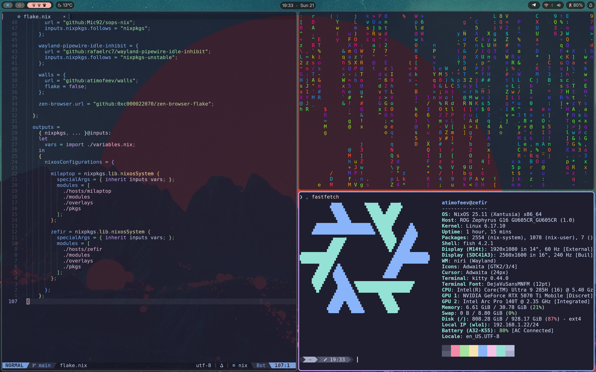

# NixOS configuration

## Apps & Utils

### Desktop Environment

#### Niri

| Type            | App               |
| --------------- | ----------------- |
| Display manager | tuigreet          |
| Compositor      | Niri              |
| Session Manager | uwsm              |
| Shell           | DankMaterialShell |
| Launcher        | Vicinae           |

#### Hyprland

_slowly being phased-out_

| Type              | App                     |
| ----------------- | ----------------------- |
| Display manager   | tuigreet                |
| Compositor        | Hyprland                |
| Session Manager   | uwsm                    |
| Wallpaper         | HyprPaper               |
| Bar, Notify, OSD  | HyprPanel               |
| Launcher          | Rofi                    |
| Idle daemon       | Hypridle                |
| Lockscreen        | Hyprlock                |
| Screenshots       | Hyprshot + Swappy       |
| Clipboard manager | wl-clipboard + cliphist |

#### Gnome

_abandoned at this point_

| Type            | App   |
| --------------- | ----- |
| Display manager | gdm   |
| Everything else | Gnome |

### Terminal

| Type              | App                                                           |
| ----------------- | ------------------------------------------------------------- |
| Terminal emulator | Kitty                                                         |
| Shell             | Fish + Nushell                                                |
| Prompt            | Starship                                                      |
| Editor            | Neovim + [NixVim](https://github.com/atimofeev/nixvim-config) |
| File browser      | Yazi                                                          |
| Audio player      | spotify-player                                                |
| Process monitor   | btop                                                          |
| GPU monitor       | nvtop                                                         |

### GUI apps

| Type         | App           |
| ------------ | ------------- |
| Browser      | Zen + Firefox |
| Video player | mpv           |
| Torrent      | qbittorrent   |
| Music making | vcv-rack      |

### Services

| Type             | App                     |
| ---------------- | ----------------------- |
| File sync        | Syncthing               |
| Homepage         | homepage-dashboard      |
| Key remapper     | kanata                  |
| Local LLM        | Ollama + Open WebUI     |
| PDF tools        | Stirling-PDF            |
| Power management | auto-cpufreq + thermald |
| Virtualization   | Docker                  |

### Additional Features

| Type                 | App                                                           |
| -------------------- | ------------------------------------------------------------- |
| User configuration   | [home-manager](https://github.com/nix-community/home-manager) |
| Secret management    | [sops-nix](https://github.com/Mic92/sops-nix)                 |
| Secure boot          | [lanzaboote](https://github.com/nix-community/lanzaboote)     |
| Gaming optimizations | [nix-gaming](https://github.com/fufexan/nix-gaming)           |
| Theming              | [catpuccin-nix](https://github.com/catppuccin/nix)            |
